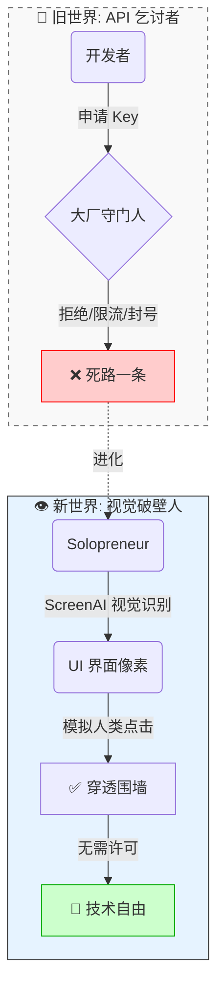

---
title:
  zh: "当 API 已死：2026 一人公司的'视觉突围'指南"
  en: "When APIs Are Dead: A 2026 Vision Breakout Guide for the One-Person Company"
description:
  zh: "如果 API 是大厂施舍的窄门，那视觉（Vision）就是我们打破围墙的攻城锤。写给那些不甘于被'围墙花园'困住的独立开发者。"
  en: "If APIs are the narrow gate controlled by big platforms, vision is the battering ram that breaks the wall. Written for indie builders who refuse to be trapped inside a walled garden."
date: "2026-02-12"
category: "Practical Guide"
tags: ["Solopreneur", "Agent", "ScreenAI", "Codex", "Infrastructure"]
draft: false
author: "James Xie"
---

# 当 API 已死：2026 一人公司的“视觉突围”指南

> 📌 **Editorial Note**: 本文写给那些不甘于被大厂“围墙花园”困住的独立开发者。如果 API 是他们施舍的窄门，那视觉（Vision）就是我们打破围墙的攻城锤。

### 01. 房间里的大象：API 时代的终结
**(Cinematic Opening)**

凌晨 3 点，你的代码报错了 `403 Forbidden`。
这不是你的错。这是 2026 年的常态。

回望过去十年，特别是 2024 年以后的互联网，我们目睹了一场悄无声息的“闭关锁国”。
Twitter (X) 关闭了免费 API，Reddit 甚至向训练数据的 AI 公司索要天价费用。每一个平台都在筑墙（Walled Garden），把数据锁在围墙之内。

**对于独立开发者（Solopreneur）来说，这意味着“连接”的路断了。**
以前，我们写一个脚本，调用 10 个 API，就能串联出一个伟大的产品（比如 Zapier）。
现在，你必须申请 Key，验证身份，忍受极其严苛的 Rate Limit，甚至被随时封号。

**API 死了。或者说，开放的 API 死了。**
大厂希望你仅仅作为一个“用户”在他们的 App 里点击，而不是作为一个“创造者”在他们的 API 上构建。

但今天，我想谈谈**突围**。

> 🎨 **配图指南 (即梦/剪映/可灵)**
> **画面描述**: 赛博朋克风格，黑色电影质感。一堵巨大的、无限延伸的混凝土墙阻挡了视野，压抑的氛围。一个发着蓝光的半透明数字人形（由代码流组成）并没有攀爬，而是像幽灵一样直接“穿透”了墙壁。
> **关键词**: 巨大高墙，数字幽灵，穿墙而过，赛博朋克，高对比度，电影光感，8k分辨率。

### 02. The Universal API：视觉即接口
**(The Core Theory)**

如果大厂关上了 API 的门，我们要怎么进去？
答案就在你的屏幕上。

**GUI (图形用户界面) 是这个世界上唯一的、真正的“通用接口”。**
只要这个软件是给人用的，它就必须把数据渲染在屏幕上；只要它是给人用的，它就必须响应鼠标的点击。

以前，我们无法利用这一点，因为传统的自动化工具（Selenium, RPA）是盲目的。它们只认 DOM 结构，一旦网页改版，脚本全挂。
但 **Google ScreenAI** 和 **OpenAI Codex** 的结合，带来了一种全新的物种：**OpenClaw (视觉智能体)**。

它不请求 API 授权，它直接**看**。
它不需要解析 JSON，它直接**理解**像素。

*   ScreenAI 看着屏幕说：“这是一个‘发送’按钮，虽然它没有 ID，但它长得像个纸飞机。”
*   Codex 看着输入框说：“这里应该填入根据上下文生成的回复。”

这不只是技术的进步，这是权利的回归。
**这是给每一个被 API 拒之门外的独立开发者的“外骨骼”。**

### 03. 重新定义“自动化”：从脆弱到反脆弱
**(The Technical Leverage)**

作为一人公司，我们的核心痛点是什么？是**维护成本**。
你写了一个爬虫，明天网站改版了，你得修半天。这种“脆弱性”让你不敢扩大规模。

但在“视觉突围”的逻辑下，自动化变得**反脆弱 (Antifragile)**。
因为 ScreenAI 模拟的是人类的认知：
*   网页改版了？颜色变了？没关系，只要“提交”按钮还在右下角，只要它逻辑上还是个按钮，AI 就能找到它。

这意味着，你可以构建一套**极其稳健的业务流**，而维护成本接近于零。
你可以像指挥一支训练有素的军队一样指挥你的 CPU：
*   “去 LinkedIn 帮我找到所有关注‘Agent’的 CTO。”
*   “去 Upwork 帮我筛选所有预算在 $5000 以上的项目。”
*   “把这些信息汇总到 Notion。”

不需要 API，不需要 OAuth，不需要求任何人。

> 🎨 **配图指南 (即梦/剪映/可灵)**
> **画面描述**: 极简等轴视图 (Isometric)，3D 盲盒风格。画面上方是一个人悠闲地坐在办公桌前喝咖啡，非常从容。地板下方是一个透明的剖面图，地下机房里有成千上万个发光的微型机器人正在疯狂敲代码/工作。
> **关键词**: 极简主义，一人公司，地下军团，等轴剖面，Blender渲染，柔和光影，白色与金色。

### 04. 结语：拿回你的杠杆
**(The Call to Action)**

大厂垄断了基建（Infrastructure），但他们无法垄断界面（Interface）。
因为界面是他们必须暴露给用户的弱点。

对于一人公司而言，2026 年最大的机会，不是去训练什么大模型（那是巨头的游戏），而是利用 **ScreenAI + Codex** 这种组合，去**重新连接**那些被切断的孤岛。

**不要再做 API 的乞讨者。**
**做视觉的主人。**

---
*Drafted by Analyst & Stylist Agent | Mr. Xie AI Consulting*
