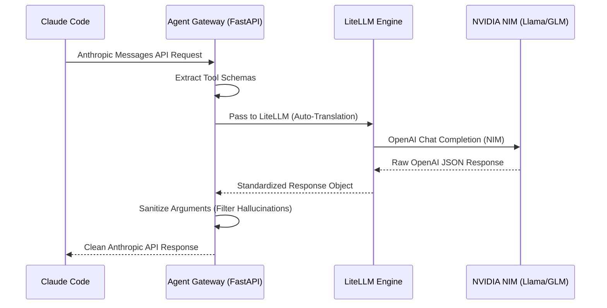

---
title:
  zh: "从简单 Proxy 到 Agent Gateway：如何利用 LiteLLM 深度榨干 NVIDIA NIM 免费额度"
  en: "From Simple Proxy to Agent Gateway: Maximizing Free NVIDIA NIM Credits with LiteLLM"
description:
  zh: "通过构建一个高性能、带工具清洗功能的 Agent Gateway，让 Claude Code 完美运行在 NVIDIA NIM 的各种开源模型上。"
  en: "Build a high-performance Agent Gateway with tool sanitization to run Claude Code flawlessly on NVIDIA NIM open-source models."
date: "2026-04-23"
category: "AI Engineering"
tags: ["LiteLLM", "NVIDIA NIM", "Claude Code", "Agent Gateway", "Architecture"]
draft: false
author: "James Xie"
---

在 LLM 领域，“白嫖”是一门艺术，而稳定地“白嫖”则是一门工程。

最近我将本地的 Claude Code 接入了 **NVIDIA NIM**。NIM 提供了大量顶级模型（如 Llama 3.1 405B, Nemotron, GLM-4/5）的免费测试额度，但要让习惯了 Anthropic Messages API 的 Claude 顺滑地跑在这些模型上，仅仅做一个简单的协议转发（Proxy）是不够的。

今天分享我构建的 **Agent Gateway** 架构，它不仅解决了协议翻译问题，还搞定了 Agent 开发中最头疼的 **“工具调用幻觉”**。

## 🏗️ 架构概览

我们的目标是构建一个“欺上瞒下”网关：对上（Claude Code）完美伪装成 Anthropic 官方接口；对下（NIM/OpenAI）利用 LiteLLM 强大的路由和重试能力。



### 核心组件

1.  **FastAPI (The Frontend)**：负责接收 Anthropic 格式的请求。
2.  **LiteLLM (The Engine)**：处理协议翻译、自动重试（Retry）和多模型 Fallback。
3.  **Custom Middleware (The Brain)**：负责最关键的 **Tool Sanitization（工具参数清洗）**。

---

## 🚀 核心黑科技：如何让“白嫖”更稳？

### 1. 协议翻译的“无损转换”
很多开源模型虽然兼容 OpenAI 格式，但在处理 Anthropic 特有的 `system` 消息和流式事件（SSE）时会有细微差别。我们利用 LiteLLM 作为内核，它能够自动处理复杂的 JSON 映射，将 Anthropic 的 `thinking` 块和 `tool_use` 块无缝对接到 NIM 接口。

### 2. Tool Sanitization：对付“幻觉”的绝招
这是最核心的工程实践。开源模型在调用工具时，经常会输出一些 Schema 之外的“幻觉参数”，或者输出带 Markdown 标签的脏 JSON，这会导致 Claude Code 直接崩溃。

我们在网关层做了两件事：
- **Robust JSON Loading**：自动剥离 Markdown 标签，处理截断的 JSON 字符串。
- **Schema Enforcement**：根据请求中的工具定义，动态过滤掉所有不在 Schema 列表中的多余参数。

### 3. 自动 Fallback：白嫖额度的最大化利用
NIM 的免费 API 往往有频率限制（429 错误）。我们在 `litellm-config.yaml` 中配置了多级 Fallback：
- 主用：`z-ai/glm5` (目前工具调用最强的国产模型)
- 备用：`nvidia/llama-3.1-nemotron-ultra-253b-v1`
- 兜底：本地 Ollama

当主模型触发限流或返回错误时，网关会在毫秒级完成切换，Claude Code 甚至感知不到后台发生了什么。

---

## 🛠️ 配置示例

通过简单的 YAML 即可管理复杂的白嫖逻辑：

```yaml
model_list:
  - model_name: "agent-best"
    litellm_params:
      model: "openai/z-ai/glm5"
      api_base: "https://integrate.api.nvidia.com/v1"
      api_key: "os.environ/NVIDIA_NIM_API_KEY"
  - model_name: "agent-best"
    litellm_params:
      model: "openai/nvidia/llama-3.1-nemotron-ultra-253b-v1"

litellm_settings:
  num_retries: 2
  enable_tool_calling_fix: True
```

---

## 🎯 总结

现在的 `nim-proxy` 不再是一个简单的 Python 脚本，而是一个具备 **自我修复** 和 **动态路由** 能力的 Agent Gateway。

它不仅让我能随意切换 NIM 上的免费额度，更重要的是，它证明了：**在 Agent 时代，网关层（Gateway）的鲁棒性比模型本身的智力更加重要。**

如果你也想打造类似的“白嫖神器”，关注我的 [Studio 页面](/studio) 获取更多源码。
