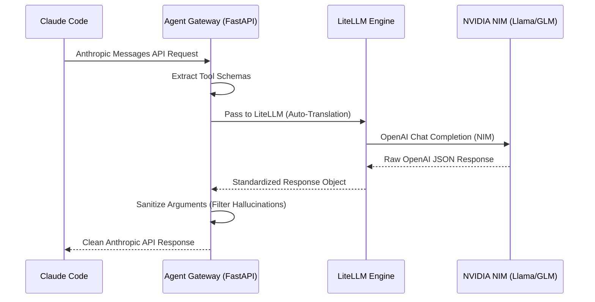

---
title:
  zh: "从简单 Proxy 到 Agent Gateway：如何利用 LiteLLM 深度榨干 NVIDIA NIM 免费额度"
  en: "From Simple Proxy to Agent Gateway: Maximizing Free NVIDIA NIM Credits with LiteLLM"
description:
  zh: "通过构建一个高性能、带工具清洗功能的 Agent Gateway，让 Claude Code 完美运行在 NVIDIA NIM 的各种开源模型上。"
  en: "Build a high-performance Agent Gateway with tool sanitization to run Claude Code flawlessly on NVIDIA NIM open-source models."
date: "2026-04-23"
category: "AI Engineering"
tags: ["LiteLLM", "NVIDIA NIM", "Claude Code", "Agent Gateway", "Architecture"]
draft: false
author: "James Xie"
---

在 LLM 领域，“白嫖”是一门艺术，而稳定地“白嫖”则是一门工程。

最近我将本地的 Claude Code 接入了 **NVIDIA NIM**。NIM 提供了大量顶级模型（如 Llama 3.1 405B, Nemotron, GLM-4/5）的免费测试额度，但要让习惯了 Anthropic Messages API 的 Claude 顺滑地跑在这些模型上，仅仅做一个简单的协议转发（Proxy）是不够斯。

今天分享我构建的 **Agent Gateway** 架构，它不仅解决了协议翻译问题，更通过一套独创的 **“分层容灾与多级重试（Tiered Resilience & Retry）”** 架构，解决了 Agent 开发中最头疼的稳定性问题。

## 🏗️ 架构概览

我们的目标是构建一个“欺上瞒下”网关：对上（Claude Code）完美伪装成 Anthropic 官方接口；对下（NIM/OpenAI）利用 LiteLLM 强大的路由和重试能力。



---

## 🚀 核心黑科技：独创的“分层容灾”架构

目前业界大部分 Proxy 还停留在“单点对接”或者“简单轮询”阶段。但在高强度的 Agent 任务（如 Claude Code 连续执行 Shell 命令）中，任何一次 429 或 500 错误都会导致整个任务链断裂。

为此，我设计了一套 **Tiered Multi-Model Retry & Cross-Tier Fallback** 体系：

### 1. 层内路由（Intra-tier Routing & Retry）
在 **Tier 1 (Agent-Best)** 这一层，我聚合了目前工具调用能力最强的四大天王：`Nemotron 3.1`, `Qwen3 Coder`, `GLM-5`, `GLM-4.7`。
- **动态权重**：利用 `latency-based-routing` 策略，网关会自动感知哪个模型的响应最快、最稳定。
- **层内重试**：当 Nemotron 报错时，网关不会立即报错，而是在 Tier 1 内部自动尝试 Qwen 或 GLM，确保“第一梯队”的高智力模型能优先完成任务。

### 2. 层间切换（Inter-tier Fallback）
如果 Tier 1 的所有模型都因为频率限制（Rate Limit）或 API 抖动无法使用，网关会触发 **Cross-Tier Fallback**，秒切到 **Tier 2 (Agent-Fallback)**。
- **兜底模型**：使用极其稳定的 `Llama 3.3 70B`。虽然智力稍逊，但 70B 的稳定性足以应对大部分常规任务，保证了 Agent 流程的 **“永不断线”**。

### 3. Tool Sanitization：对付“幻觉”的硬核手段
开源模型在调用工具时，经常会输出一些 Schema 之外的“幻觉参数”，或者输出带 Markdown 标签的脏 JSON。
我们在网关层通过 **Schema Enforcement** 机制，动态过滤掉所有不在定义列表中的多余参数。**这是让开源模型真正能跑通 Claude Code 复杂工具链的秘诀。**

---

## 🛠️ 配置示例（真正的工业级干货）

通过这份配置，你可以瞬间拥有一个具备“自动驾驶”能力的 Agent Gateway：

```yaml
model_list:
  # 🚀 Tier 1: Agent Best (高智力模型组)
  - model_name: "agent-best"
    litellm_params:
      model: "openai/nvidia/llama-3.1-nemotron-ultra-253b-v1"
      api_key: "os.environ/NVIDIA_NIM_API_KEY"
  - model_name: "agent-best"
    litellm_params:
      model: "openai/qwen/qwen3-coder-480b-a35b-instruct"
      api_key: "os.environ/NVIDIA_NIM_API_KEY"

  # 🛡️ Tier 2: Agent Fallback (高稳定性兜底)
  - model_name: "agent-fallback"
    litellm_params:
      model: "openai/meta/llama-3.3-70b-instruct"
      api_key: "os.environ/NVIDIA_NIM_API_KEY"

litellm_settings:
  num_retries: 3 # 层内重试
  fallbacks:
    - agent-best: ["agent-fallback"] # 层间切换

router_settings:
  routing_strategy: "latency-based-routing"
  # 关键：识别哪些错误需要触发 Fallback
  base_model_fallback_proxy_errors: ["rate_limit_error", "api_error", "timeout_error"]
```

---

## 🎯 总结

在 Agent 时代，**网关层（Gateway）的鲁棒性比模型本身的智力更加重要**。

通过 **“层内重试 + 层间切换”** 的独特设计，我们不仅榨干了 NVIDIA NIM 的免费额度，更构建了一个永不宕机的 AI 动力源。如果你也想体验这种“丝滑”的 Agent 开发流程，欢迎参考我的 [Studio 页面](/studio) 获取完整源码。
