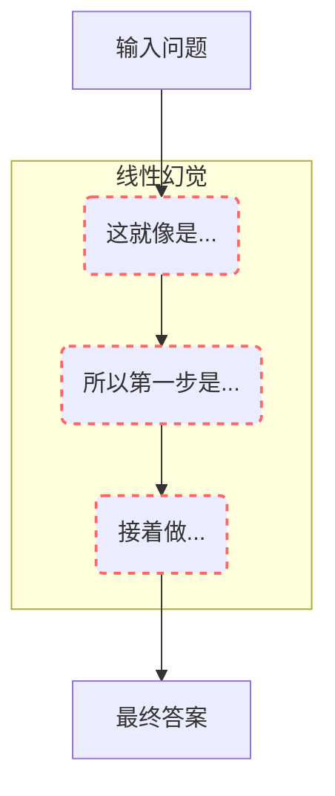
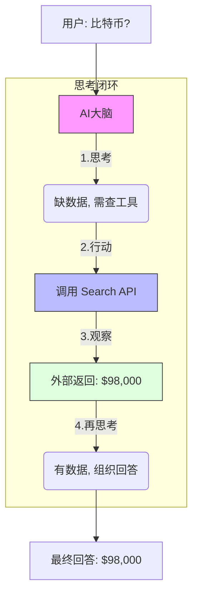
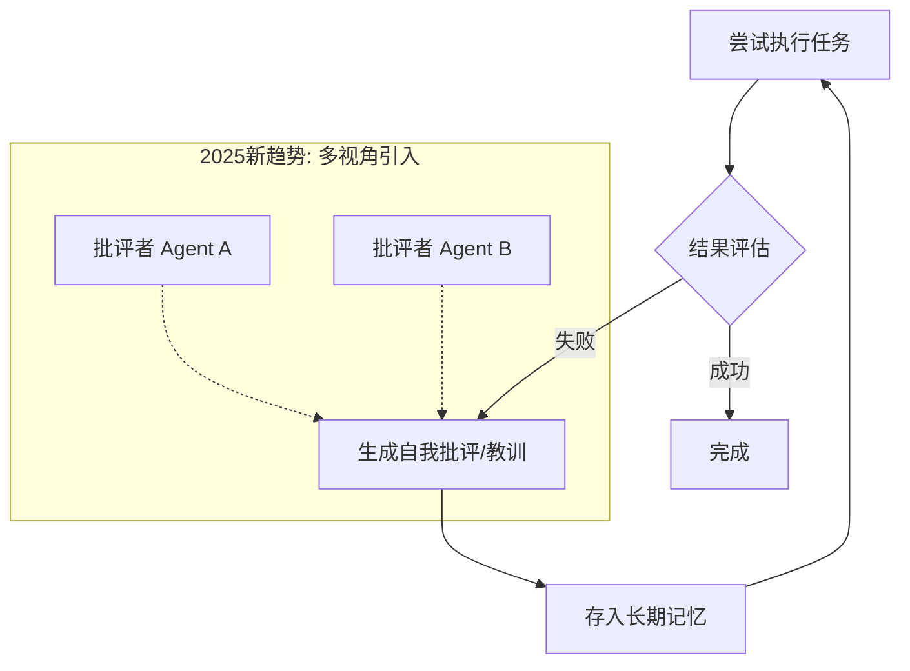
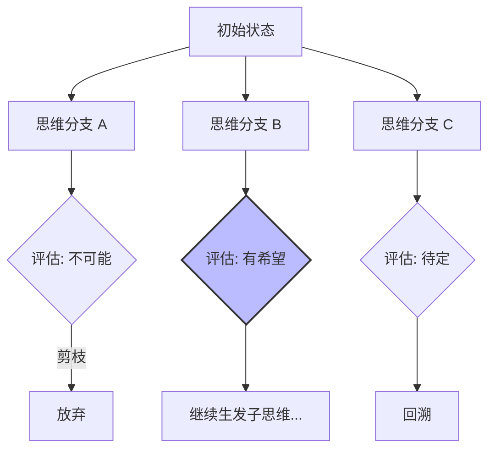
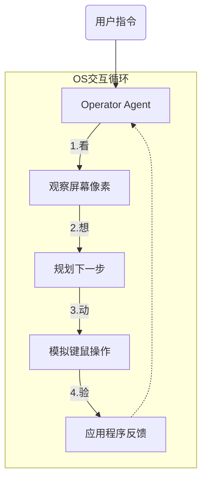
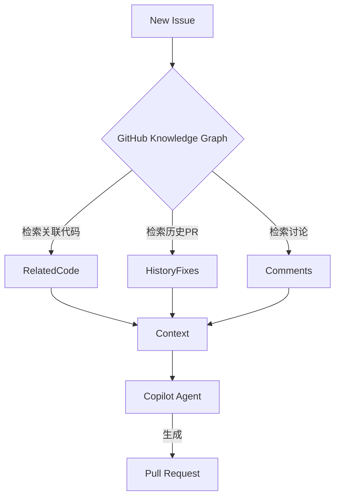
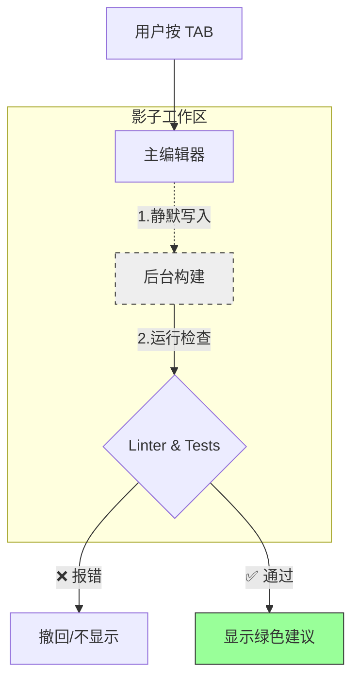
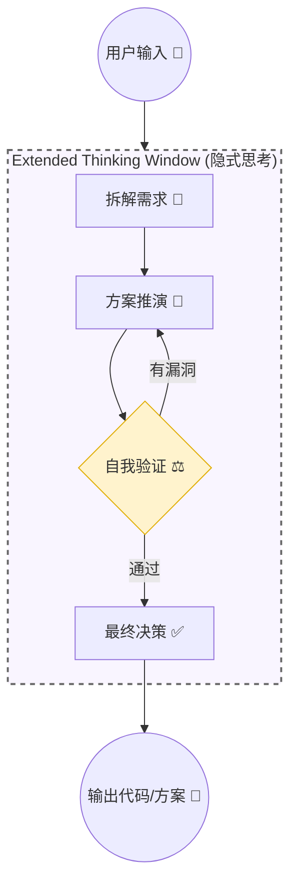

---
title:
  zh: "只微调还不够：从'一本正经胡说八道'到'三思而后行'：揭秘 AI Agent 的五种思维模式"
  en: "Fine-Tuning Is Not Enough: From 'Confidently Nonsensical' to 'Think Before Acting': Revealing the Five Thinking Patterns of AI Agents"
description:
  zh: "AI 变强的真正质变在于'思维模式'的重构。结合两年观察，深度解构 AI Agent 的思考范式演变，揭示从胡说到深思的大脑机制。"
  en: "The real qualitative change in AI's strength lies in the reconstruction of 'thinking patterns'. Combining two years of observation, deeply deconstructing the evolution of AI agent thinking paradigms, revealing the brain mechanisms from nonsense to deep thinking."
date: "2026-04-20"
category: "AI Research"
tags: ["Agent Architecture", "Reasoning Patterns", "AI Thinking", "Cognitive Science"]
draft: false
author: "James Xie"
---

# 只微调还不够：从'一本正经胡说八道'到'三思而后行'：揭秘 AI Agent 的五种思维模式

> **写在前面**：最近在研究 Agent 的底层架构，越看越觉得有意思。很多人觉得 AI 变强是因为模型参数变大了，但我觉得真正的质变在于**"思维模式" (Reasoning Patterns)** 的重构。今天不聊枯燥的论文，想结合这两年的观察，聊聊我对 AI 思考范式演变的个人理解，顺便画了几张图来解构它们的大脑。

## 💡 为什么 ChatGPT 总是"一本正经胡说八道"？

很久以前我们就在质疑，LLM 到底是在"推理"，还是在做高级的"填空题"？

2026 年的今天，回看 OpenAI 的 o 系列和 **Gemini 3 Pro**，最让我兴奋的不是它们的跑分，而是它们终于学会了**System 2 (慢思考)**。

简单的说，以前的 AI 是**张口就来**（System 1 直觉），现在的 AI 学会了**打草稿、反思、甚至自我否决**。这种"元认知"能力的涌现，才是我认为通向 AGI 的真正钥匙。

下面我整理了 5 种最核心的思考模式，并附上了我重新梳理的架构图。

---

## 1. 让思维"连点成线"：Chain of Thought (CoT)

大家对 CoT 肯定不陌生，那句 `Let's think step by step` 简直是 AI 界的芝麻开门。

但我最近看了一些 2025 年的复盘研究，发现了一个很有趣（甚至有点细思极恐）的观点：**CoT 很可能只是一个"脆弱的幻影"**。

研究表明，CoT 的有效性很大程度上源于**模式匹配** (Turpin et al.)。也就是说，AI 并不是真的像人类那样理解了逻辑环，它只是学到了"由 A 推导 B 再推导 C" 这种**文本结构**。一旦我在中间加一点干扰信息，AI 的推理链条瞬间就会崩塌，产生"误差级联"。

**我的思考**：
CoT 是必要的，但绝对不是终点。它就像是给小学生立规矩，强制他写出解题步骤，但这不代表他真的懂了微积分。

---

## 2. 让大脑"手脑并用"：ReAct (Reasoning + Acting)

如果说 CoT 是"脑子里的风暴"，那 ReAct 就是"长了手的实体"。

这是我最喜欢的一个范式。纯 LLM 是"缸中之脑"，它所有的知识都截止于训练结束那天。ReAct 的精髓在于把 **思考 (Reasoning)** 和 **行动 (Action)** 结合了起来。

**我的思考**：
ReAct 的本质是**承认无知**。AI 意识到"这个问题我不知道"，于是去查 Google、去读文件、去调 API。这种"知之为知之，不知为不知"的机制，才是 Agent 走向实用的第一步。

---

## 3. 让模型"吾日三省"：Reflexion (反思与多智能体)

这是 2025 年争议最大的地方。最初的 Reflexion 是让 AI 自己检查自己："我哪里做错了？"。

但在实际跑代码生成任务时，我发现单体 Agent 往往会陷入**"确认偏差" (Confirmation Bias)**——它会极其自信地解释它生成的错误代码是对的，死不悔改。

**我的思考**：
"医者不能自医"。一个模型很难跳出自己的概率分布去纠错。所以 2025 年底爆发的 **Multi-Agent Reflexion (MAR)** 才是正解。引入一个"死对头"角色（Critic）专门挑刺，这种对抗性的辩论机制，直接把代码生成的准确率干到了 80% 以上。

---

## 4. 让决策"三思后行"：Tree of Thoughts (ToT)

这种模式让我看到了 AI 拥有"直觉"之外的"规划力"。根据 Yao et al. (2023) 的研究，在经典的 "24点游戏" 中，普通 GPT-4 成功率仅 4%，而用了 ToT 后飙升至 74%。

普通的 AI 是写哪算哪（Token by Token），而 ToT 赋予了 AI **回溯 (Backtracking)** 的能力。就像下围棋，走这一步之前，先在脑子里运算三种可能的结果，如果发现那条路是死胡同，就退回来重走。

**我的思考**：
ToT 是 System 2 思维的极致体现。虽然它慢，但在数学证明、复杂逻辑解谜、创意小说写作这些领域，它是降维打击。未来的 Agent 一定是 **动态路由** 的：简单问题用 System 1 秒回，复杂问题自动唤醒 ToT 深度搜索。

---

## 5. 让灵感"触类旁通"：Graph of Thoughts (GoT)

比树更复杂的，是网。

**GoT** 突破了树状结构的限制，允许思维节点任意连接。它可以模拟人类团队的"头脑风暴"：先发散（生成多个想法），再聚合（集思广益），再精炼（反复打磨）。

**我的思考**：
这是真正的"群体智慧"模拟。未来的复杂软件工程，一定是一个 GoT 网络：有的节点负责写代码，有的负责 Review，有的负责写文档，它们相互连接，动态迭代。

---

## 6. 现实验证：主流 Coding Agent 的进化图谱

为了让大家更直观地理解，我将目前市面上最火的 4 款 Coding Agent 按照**思维深度**进行了重组。

---

### 6.0 起源 (System 1): OpenAI Codex / Operator
**——"从直觉到行动"**
*   **对应模式**: **纯直觉** $\rightarrow$ **通用行动**
*   **演进**: 从“单纯补全代码”到“接管操作系统”。

> **💡 谢先生的深度思考**：
> 很多人忽视了 Operator 的战略意义。如果说 Copilot 是让程序员更爽，Operator 则是要**革掉 GUI 的命**。
> 当 AI 能像人一样操作浏览器时，我们为人类设计的图形界面（按钮、表单、CSS）对此刻的 AI 来说就是累赘。未来的软件交互，可能会绕过 UI，直接变成 **Agent to Agent** 的协议对接。

---

### 6.1 混合流 (Hybrid): GitHub Copilot (Workspace 2.0)
**——"懂你家谱的自动驾驶"**
*   **对应模式**: **CoT (轻量级)** + **Knowledge Graph**
*   **核心机制**: 引入真正的 **Agent Loop**，通过 **GitHub Knowledge Graph** 理解你仓库过去 10 年的 Issue 和 PR。

> **💡 谢先生的深度思考**：
> Copilot 最近的进化让我意识到，**Context（上下文）才是护城河**。
> 模型本身的能力会同质化，但只有 GitHub 拥有你代码仓库的“家谱”。这给企业的启示是：**私有数据的结构化治理，比囤积显卡更重要**。

---

### 6.2 增强直觉 (System 1.5): Cursor (Composer 3.0)
**——"平行宇宙的收敛者"**
*   **对应模式**: **Automated Reflexion (自动化反思)**
*   **核心机制**: **Fast Apply** + **Shadow Workspace**。在你按 Tab 瞬间，后台平行宇宙已经跑完了测试。

> **💡 谢先生的深度思考**：
> Cursor 揭示了软件开发的未来：**"Simulation First" (模拟优先)**。
> 我们正在从“代码编写者”变成“平行宇宙收敛者”。这意味着，**程序员的门槛不是降低了，而是变了——你必须具备更高阶的评估能力，通过 Review 并不完全由你创造的代码来为系统兜底。**

---

### 6.3 慢思考 (System 2): Claude 4.5 Opus
**——"老谋深算的架构师"**
*   **对应模式**: **Deep ToT (深度思维树)**
*   **核心机制**: **Extended Thinking Window**。在写代码前，先进行长达数分钟的隐式推理和剪枝。

> **💡 谢先生的深度思考**：
> 我把 Claude 4.5 称为**"软件工程的回归"**。
> 在 AI 时代，**"慢"就是"快"**。当你可以用 30 秒等待一个完美的重构方案时，你会发现它解决的不是效率问题，而是**技术债务**问题。对于背负历史包袱的企业级项目，Claude 比任何手速快的实习生都管用。

---

## 7. 结语：从"提示词工程"到"认知架构设计"

写到这里，回顾我们讨论的 CoT、ReAct 到现在的 Graph of Thoughts，以及 Copilot Workspace 和 Claude 4.5 Opus 的实战演进，我最大的感触是：**AI 正在从一个"概率预测器"进化为一个"逻辑推理体"。**

### 7.1 认知的内化 (Thinking Within)
我们在 2023-2024 年费尽心思设计的思维链（CoT）和思维树（ToT），到了 2026 年正在发生一个有趣的质变：**外挂的架构正在变为内生的本能。**
像 Gemini 3 Pro 和 Claude 4.5 已经开始提供 `thinking_effort` 这样的 API 参数。这意味着，也许不久的将来，我们不再需要自己在应用层手写 `while` 循环来实现 ReAct，而是直接告诉模型：“这件事很难，请用 System 2 思考模式，尝试 5 种路径后再回答我。”

### 7.2 给开发者的建议
在这个 Agent 爆发的时代，作为开发者，我们的核心竞争力在哪里？
*   **不再是写 Prompt**：简单的 Prompt 已经被模型内化了。
*   **而是定义"思考的边界"**：如果是 System 1 的任务（如代码补全），我们要追求极致的速度和上下文感知（如 Cursor）；如果是 System 2 的任务（如架构重构），我们要设计足够完善的 Evaluation（评估）机制，防止 AI 在错误的思维树上越走越远。
*   **更是构建"私有知识图谱"**：GitHub Copilot 的 Knowledge Graph 告诉我们，AI 思考的质量，取决于它能检索到多少高质量的上下文。

> **💡 谢先生的最终思考**：
> 很多人担心 AI 越来越强，程序员会不会失业？
> 我认为恰恰相反。以前我们是**"写代码" (Coding)**，把业务逻辑翻译给机器；现在我们是**"设计思维" (Thinking Design)**，教 AI 如何像专家一样去推理。
>
> 真正的危机感不应来自 AI 的强大，而应来自我们**对业务本质理解的浅薄**。如果你清楚地知道一个问题该如何一步步解决（Algorithm），你就能构建出强大的 Agent；如果你自己都想不清楚，再强的 System 2 也救不了你。
>
> **未来的赢家，属于那些能用 AI 构建"思维脚手架"的人。**

---
*本文基于 2026 年 2 月的前沿观察整理。转载请注明出处。*
