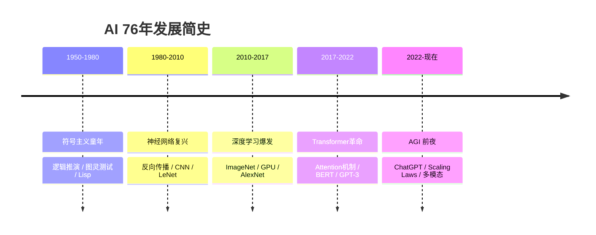
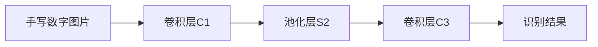
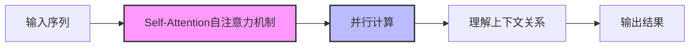
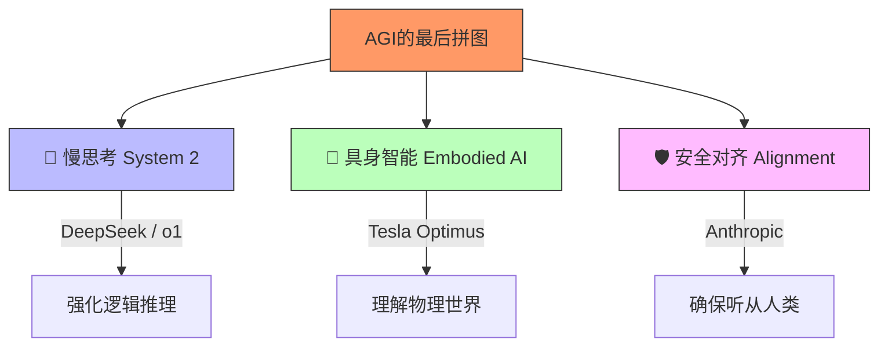

---
title:
  zh: "深度复盘：从图灵到AGI，76年AI激荡史与关键人物图谱"
  en: "Deep Retrospective: From Turing to AGI, 76 Years of AI History and Key Figures"
description:
  zh: "站在2026年的门槛，回顾跨越76年的AI马拉松。从图灵测试到ChatGPT，充满天才狂想、资本博弈、学派倾轧，以及无数次绝地反击。"
  en: "Standing at the threshold of 2026, looking back at the 76-year AI marathon. From the Turing Test to ChatGPT, filled with genius visions, capital games, academic rivalries, and countless comebacks from dead ends."
date: "2026-01-15"
category: "History"
tags: ["AI History", "Alan Turing", "AGI", "Tech History"]
draft: false
author: "James Xie"
---

# 深度复盘：从图灵到AGI，76年AI激荡史与关键人物图谱

> **写在前面**：  
> 站在2026年的门槛，ChatGPT已成日常，Copilot写满了屏幕。许多人以为AI是一夜之间从石头缝里蹦出来的。但作为业内人，我深知这是一场跨越76年的马拉松。这期间充满了天才的狂想、资本的博弈、学派的倾轧，以及无数次从“死胡同”里的绝地反击。
>
> 这篇文章不是枯燥的编年史，而是我想聊聊那些**改变了历史走向的关键瞬间**，以及藏在技术背后的**人性与思想**。

---

## ⏳ 极简史：AI的五次重生与底层逻辑

如果把AI看作一个生命，他今年76岁了。他不是线性成长的，而是像凤凰一样，经历了多次涅槃。每一次重生，都是对上一次信仰的彻底背叛。



**1. 符号主义童年 (1950-1980)**  
👉 **核心信仰**：**智能 = 逻辑 + 规则**。只要把世界的所有规则写进代码，机器就有智能。  
👉 **致命伤**：世界太复杂，规则写不完。“常识”是逻辑的坟墓。  
👉 **结局**：解决了数学证明，但连“识别一只猫”都做不到。

**2. 神经网络复兴 (1980-2010)**  
👉 **核心信仰**：**连接主义**。模仿大脑皮层，与其写规则，不如造个“大脑”让它自己学。  
👉 **至暗时刻**：1969年明斯基一本《感知机》从数学上证明了单层网络的局限（XOR问题），直接判了神经网络死刑。此后30年，搞这个方向的人被视为“炼金术士”。  
👉 **结局**：Hinton等人坚持下来了，在边缘地带守住了火种。

**3. 深度学习爆发 (2010-2017)**  
👉 **核心信仰**：**深层网络 + 大数据**。  
👉 **关键变量**：李飞飞的ImageNet提供了数据，黄仁勋的GPU提供了算力。两者相遇，天雷勾地火。  
👉 **结局**：AI终于有了眼睛，计算机视觉（CV）统治了一个时代。

**4. Transformer革命 (2017-2022)**  
👉 **核心信仰**：**Attention is All You Need**。放弃循环（RNN），拥抱并行。  
👉 **本质突破**：把自然语言处理（NLP）变成了纯粹的数学计算问题。模型不再需要像人类一样“逐字阅读”，而是一眼看穿全文（并行注意力）。  
👉 **结局**：大模型一统江山，所有NLP任务被降维打击。

**5. AGI 前夜 (2022-现在)**  
👉 **核心信仰**：**Scale is All You Need（大力出奇迹） + 压缩即智能**。  
👉 **现状**：我们发现，只要让模型拼命预测“下一个词”，它竟然为了把那个词猜对，顺便学会了逻辑、编程甚至物理规律。  
👉 **结局**：ChatGPT出现，图灵测试在事实上已经被跨越。

> 💡 **我的思考**：  
> 为什么AI总是“起起落落”？因为我们总在**高估短期，低估长期**。80年代专家系统火的时候，日本人曾斥巨资搞“第五代计算机”，结果惨败。2012年Siri出来时被嘲笑是人工智障。但就在这种忽冷忽热中，技术的底层水位（算力、数据、算法）一直在悄悄上涨。Rich Sutton曾提出过著名的**“苦涩的教训”（The Bitter Lesson）**：短期内利用人类知识（规则、特征工程）很有效，但长期看，只有**利用算力的通用方法（学习+搜索）**才能最终胜出。人类的傲慢，在于总想教AI怎么思考；而AI的胜利，在于它学会了自己思考。

---

## 🏛️ 第一章：开创者的哲学 (1950-1980)

### 🏆 Alan Turing (阿兰·图灵)
*计算机科学之父 | 英国*


> "我们只能看到前方很短的距离，但那里有大量工作要做。"

大多数人只知道图灵测试，但图灵最伟大的贡献是**图灵机**。他证明了：**一切计算过程都可以被机械化**。既然大脑的思考也是一种物理过程，那它理论上就可以被机器模拟。这是AI存在的**理论合法性**来源。

### 🏆 John McCarthy (约翰·麦卡锡)
*AI学科之父 | 美国*


> "一旦一样东西开始工作，我们就不再叫它AI了。"

1956年达特茅斯会议，那个夏天，麦卡锡、明斯基、香农等人聚在一起，以为花个把月就能解决AI。这种**盲目的乐观**是所有伟大事业的开端。他还发明了 **Lisp**——这不仅仅是一门语言，它把代码当成数据处理的思想（代码即数据），某种程度上预示了今天大模型“把程序也当语料”的未来。

> 💡 **我的思考**：  
> 符号主义的失败是注定的吗？其实现在的**RAG（检索增强生成）**和**CoT（思维链）**，某种程度上是符号主义的“魂”回归了。纯粹的神经网络是个黑盒，只有结合了符号逻辑的推理（System 2慢思考），AI才算完整。**历史是个圈，好的思想总会换个马甲回来。**

---

## 🔥 第二章：孤独的守夜人 (1980-2010)

### 🏆 Geoffrey Hinton (杰弗里·辛顿)
*深度学习教父 | 2024诺贝尔物理学奖得主（图灵奖得主）*


**硬核故事**：
如果不了解Hinton受过的冷遇，就无法理解他的伟大。在80-90年代，学术会议上他的论文被安排在没人听的时间段，申请经费屡屡被拒。主流学派认为神经网络是“死胡同”，因为太难训练（梯度消失）。
但他解决了两个核心问题：
1.  **反向传播 (BP)**：从数学上解决了“由于不知道哪里错了，所以没法改”的问题。
2.  **信念**：即使全世界都说你错了，你敢不敢坚持？

### 🏆 Yann LeCun (杨立昆)
*卷积网络之父 | Meta首席AI科学家*




**硬核故事**：
他在贝尔实验室发明了CNN，成功用于识别支票手写数字。这在当时是神经网络为数不多的实际应用。但他不仅是科学家，更是个**斗士**。今天你看他在Twitter上怼天怼地（怼OpenAI如果不开源就是邪恶，怼Sora不懂物理世界），其实这种“战斗型人格”贯穿了他的一生。

> 💡 **我的思考**：  
> Hinton在2012年拿ImageNet冠军时已经64岁了。他整整坐了30年的冷板凳。这让我反思：在现在的技术圈，大家都在追热点，半年就要出成果。还有没有人愿意为了一个“目前看起来没用”的理论死磕十年？**真正的创新，往往来自于那些被主流视作“异类”的边缘地带。**

---

## 🚀 第三章：工程化与暴力的美学 (2010-2017)

### 🏆 Fei-Fei Li (李飞飞)
*计算机视觉女王 | 斯坦福*


**核心贡献**：
她做了一件当时看来很“笨”的事：找人手动给几千万张图片打标签。这就是 **ImageNet**。
在算法停滞不前的时候，她敏锐地意识到：**可能是因为我们的数据不够多，而不是算法不够好。** 她改变了游戏规则：从“算法为王”转向了“数据为王”。

### 🏆 Jensen Huang (黄仁勋)
*皮衣刀客 | NVIDIA CEO*


**核心贡献**：
这不仅是商业故事，更是技术洞察。黄仁勋早年就坚信**GPU不应该只用来玩游戏**。他孤注一掷推CUDA架构，哪怕股价腰斩也不放弃。
结果，深度学习需要的“矩阵并行计算”能力，恰好就是GPU最擅长的。这哪是运气？这是**对计算本质的深刻理解**带来的红利。

> 💡 **我的思考**：  
> 这十年是“暴力美学”的胜利。学术界曾追求精妙的特征工程（SIFT、HOG），试图教机器“什么是猫的耳朵”。但深度学习说：**“别废话，给我看一亿张猫的照片，我自己悟。”** 这不仅是技术的胜利，更是**经验主义对理性主义**的胜利。

---

## 🌌 第四章：大模型与通用智能 (2022-2026)

现在，我们正处于风暴眼。

### 🏆 Ashish Vaswani & The Transformer Team
*Google Brain 八子*



**核心贡献**：
2017年的论文《Attention Is All You Need》。这大概是AI史上性价比最高的一篇论文。
他们抛弃了所有复杂的循环结构（RNN/LSTM），只用**注意力机制**。这不仅让模型效果更好，更重要的是**彻底释放了并行计算的潜力**。可以说，没有Transformer，就没有后来的GPT。
*讽刺的是，这8位作者后来全跑了，没人留在Google。这或许就是“大企业的诅咒”。*

### 🏆 Ilya Sutskever
*AGI 激进派 | 前OpenAI首席科学家*


```text
[Scaling Laws 核心逻辑：大力出奇迹]

性能 (Performance)
  ^
  |                  /
  |                /
  |              /
  |            /
  |          /
  |        /
  |      /
  |    /
  +-------------------------------------> 算力 (Compute)
     10^18   10^20   10^22   10^24

*随着算力和数据量的指数级增加，模型性能呈线性增长（Log-Linear），且尚未看到天花板。*
```

**核心地位**：
他是 **Scaling Laws** 的坚定信徒。他相信：**“预测下一个词”这个动作，本质上是在压缩世界知识。** 为了预测得准，模型必须理解语法、逻辑、因果甚至心理学。
他是那个敢把OpenAI所有算力All-in在一个模型上的人。这种赌性，源于对第一性原理的极度自信。

### 🏆 Sam Altman (山姆·奥特曼)
*OpenAI CEO | 操盘手*


**核心地位**：
他不是科学家，他是**战略家**。他把AI从“实验室样品”变成了“消费品”。他最厉害的一点是：在技术还没完美之前，就敢发出来让10亿人免费帮他测试（RLHF - 人类反馈强化学习）。
他正在重新定义“人机关系”——AI不是工具，是**Copilot（副驾驶）**。

> 💡 **我的思考**：  
> 为什么是OpenAI做成了，而不是Google？Google发明了Transformer，拥有最多的TPU和人才。
> 答案可能在于**“创新者的窘境”**。Google太有钱了，太在意声誉了，不敢发一个会胡说八道的聊天机器人。而OpenAI光脚不怕穿鞋的，有着近乎宗教般的AGI信仰。**在那家旧金山的破办公室里，Ilya目光如炬地说“Feel the AGI”时，胜负已分。**

---

## 🌏 2026年：路向何方？

### 迷雾中的三个方向



### 📊 2026 顶尖模型战力榜 (业内体感评估)

| 模型 | 逻辑推理 | 代码能力 | 多模态 | 创意写作 | 综合评价 |
| :--- | :--- | :--- | :--- | :--- | :--- |
| **GPT-5** | ▮▮▮▮▮ | ▮▮▮▮▮ | ▮▮▮▮▯ | ▮▮▮▮▯ | 👑 全能王者 |
| **Claude Opus** | ▮▮▮▮▮ | ▮▮▮▮▯ | ▮▮▮▮▯ | ▮▮▮▮▮ | 🧠 文科状元 |
| **Gemini 3 Pro** | ▮▮▮▮▯ | ▮▮▮▮▮ | ▮▮▮▮▮ | ▮▮▮▮▯ | 👁️ 多模态之神 |
| **DeepSeek** | ▮▮▮▮▮ | ▮▮▮▮▮ | ▮▮▮▯▯ | ▮▮▮▮▯ | 💰 性价比之王 |

**1. 慢思考 System 2 (OpenAI o1 / DeepSeek)**  
之前的LLM是“张口就来”（System 1 直觉），现在的方向是让AI在回答前先“想一会儿”（Chain of Thought）。这让AI的数学和编程能力暴涨。**推理**，是通往AGI的最后门槛。

**2. 具身智能 (Embodied AI)**  
大脑已经够聪明了，现在需要给它一个身体。Tesla Optimus正在工厂里拧螺丝。**只有理解了物理世界的摩擦力、重力和触感，AI才算真正理解了世界。**

**3. 安全与对齐 (Anthropic)**  
如果AI比聪明一万倍，它为什么要听你的？**对齐问题 (Alignment)** 不是科幻，而是迫在眉睫的工程问题。

> 💡 **我的思考**：  
> 很多人焦虑AI会取代人类。我的观察是：**AI取代不了人性。**
> 它可以写出完美的十四行诗，但它无法感受失恋的痛苦；它可以画出绝美的日落，但它没看过真正的夕阳。
> 在2026年，**“匠人精神”会贬值（因为AI做得更快），但“人类的连接”会升值。** 心理咨询师、护士、甚至是一个真诚的销售，这些需要同理心的职业，反而会更稀缺。

---

## 📝 结语

AI的发展史，就是一部人类不断试图创造“自我映射”的历史。
从图灵的自杀，到Hinton的坚持，再到Altman的野心，每一步都走得惊心动魄。

我们这代人何其有幸，能亲眼见证**硅基智能的觉醒**。
不要恐惧，去理解它，去驾驭它。
毕竟，**这是人类造出的最后一项发明。**

---
*MyAgentToolBox 研究团队 | 2026年2月*
