---
title:
  zh: "对标美国六巨头，解读中国 AI 的'一超多强、四龙夺珠'"
  en: "Benchmarking Against US Big Six: Decoding China's AI 'One Superpower, Multiple Strong Players, Four Dragons Competing'"
description:
  zh: "2026年，中国AI告别'百模大战'的浮躁，进入残酷的'应用收割期'。华为的算力底座稳了吗？Kimi和豆包谁是C端之王？对标美国六大科技巨头，拆解24个月来的产业剧变。"
  en: "In 2026, Chinese AI bids farewell to the frenzy of the 'Hundred Model War' and enters the brutal 'Application Harvest Period'. Is Huawei's computing foundation stable? Who is the king of consumer AI—Kimi or Doubao? Benchmarking against the US Big Six tech giants to decode 24 months of industry upheaval."
date: "2026-02-15"
category: "Industry Analysis"
tags: ["China AI", "Industry Analysis", "Huawei", "DeepSeek", "Market Competition"]
draft: false
author: "James Xie"
---

# 对标美国六巨头，解读中国 AI 的"一超多强、四龙夺珠"

> **摘要**：2026 年，中国 AI 告别"百模大战"的浮躁，进入残酷的"应用收割期"。华为的算力底座稳了吗？Kimi 和豆包谁是 C 端之王？对标美国六大科技巨头，我们的差距在哪里、机会在哪里？本文为你拆解这 24 个月来的产业剧变。

各位朋友，我是谢先生，技术观察者

今天这篇是**深度干货**。我们不聊虚的概念，直接把时间拨到 2026 年 2 月。

站在这个节点回望，**过去这24个月堪称中国AI史上最疯狂的洗牌期**：

- **2024年**：305个大模型扎堆发布，平均每天一个，像极了当年的千团大战
- **2025年**：DeepSeek用557万美元颠覆了5亿美元的游戏规则，智谱、MiniMax抢滩港股上市，"AI六小龙"格局彻底分化

而现在，战场已经打扫得差不多了，牌桌上只剩下几位真正的大佬。

但与美国不同的是——美国是 **六大科技巨头（Apple, Nvidia, Microsoft, Alphabet/Google, Amazon, Meta）** 的全栈生态战争，而中国呈现的是"**一超多强，四龙夺珠**"的独特格局：

- **一超**：华为（算力垄断，昇腾芯片+智算中心）
- **多强**：阿里（Qwen生态）、百度（ToB销售）、腾讯（微信生态）、字节（豆包+流量）
- **四龙**：DeepSeek（技术极客）、Kimi（长文本之王）、智谱AI（已上市）、MiniMax（已上市）

为了让大家看清局势，我特意绘制了这张 **2026 中国 AI 产业全景图**：

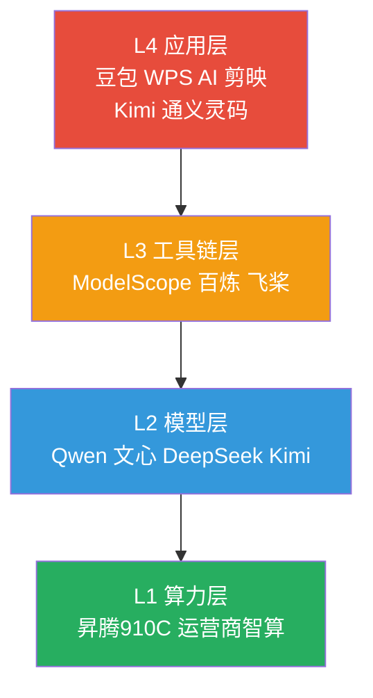

---

## 🌍 与国外版呼应：L1-L4 对照速览

| 层级 | 中国代表 | 国外代表 | 结论要点 |
|:---|:---|:---|:---|
| **L1 算力** | 昇腾 910C、运营商智算 | NVIDIA/TPU/Trainium | **国产替代确定性强，但规模化差距仍在** |
| **L2 模型** | Qwen、文心、DeepSeek、Kimi | GPT-5.2、Claude、Gemini、Llama | **顶尖智力差距 1-1.5 年，细分场景可突围** |
| **L3 工具链** | ModelScope、百炼、飞桨 | Bedrock、LangChain、Semantic Kernel | **生态广度不足，但“能用且好用”** |
| **L4 应用** | 豆包、WPS AI、剪映 | ChatGPT、Copilot、Meta AI | **C 端速度领先，B 端要看落地深度** |

*(这张表就是中国版与国外版的“桥梁”。看懂它，就看懂了两篇文章的呼应关系。)*

**我的判断（更直白一点）：**
1. **中国的强项是"部署效率"，美国的强项是"技术上限"。**
2. **L4 应用层是中国的最强反攻点，但不会自动转化为全球优势。**
3. **真正的胜负手是"算力成本 + 场景封闭性"。**谁能在行业里跑通闭环，谁就能赢。

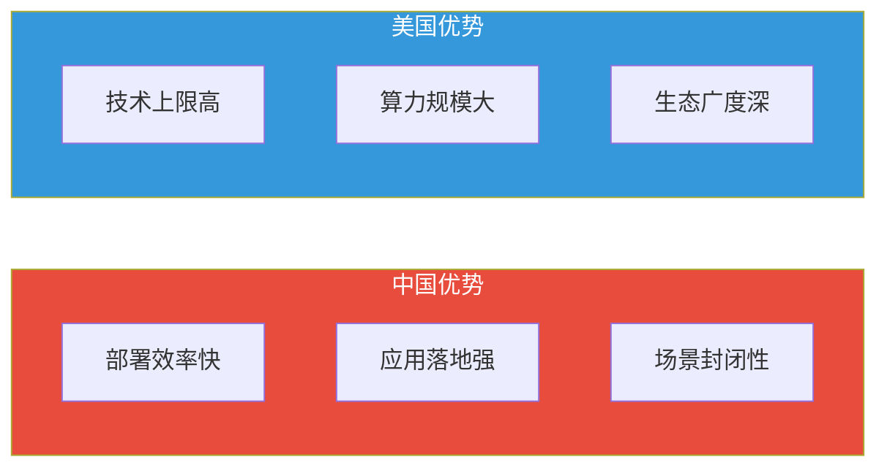

---

## ⚔️ 第一章:顶层权力游戏(The Big Seven)

只要你还在用智能手机,这七家公司的 AI 你就躲不掉。现在的格局是 **"一超多强,四龙夺珠"**。

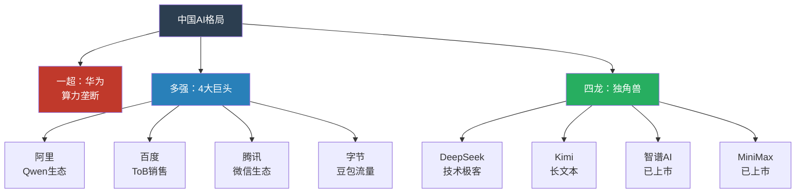

### 🏛️ 守城派:基建狂魔

**1. 华为 (Huawei) —— "中国的 NVIDIA + AWS"**
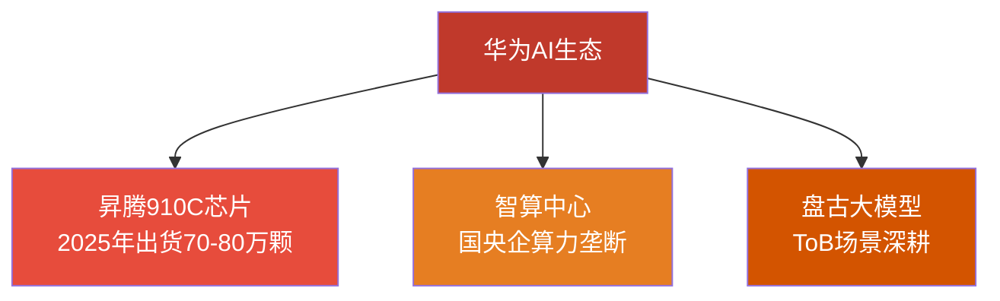
*   **核心底牌**:**算力垄断**。
*   **现状**:别看盘古模型不怎么在 C 端露面,但你脚下的煤矿、头顶的气象卫星、手里的政务 App,背后跑的都是 **昇腾 910C**。在"信创"要求下,华为几乎吃下了所有国央企的算力订单。
*   **对标美国**:华为同时扮演着 NVIDIA (L1 算力芯片) 和 Amazon (云基础设施) 的角色,但受限于先进制程制裁,单卡性能仍有差距。
*   **我的判断**:华为是这场 AI 战争中**唯一不担心"商业模式"**的玩家。即使模型不赚钱,算力硬件也卖断货了。这是政策红利,也是战略必需。

**2. 阿里 (Alibaba) —— "中国的 Meta + Amazon Bedrock"**
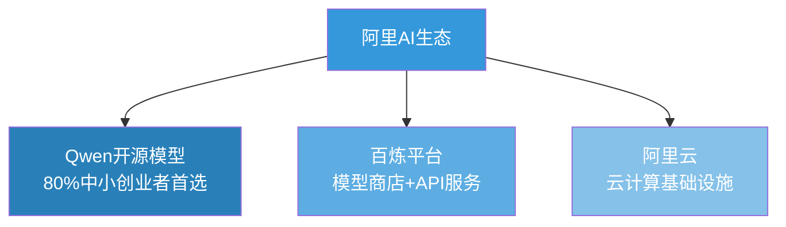
*   **核心底牌**:**Qwen 生态 + 阿里云**。
*   **现状**:Qwen-2.5 乃至 Qwen-Max,已经成了中国版的 **Llama**。阿里的策略极度聪明——**用开源换生态**。现在 80% 的中小创业者,起手式就是"微调一个 Qwen"。
*   **对标美国**:对标 Meta 的 Llama 4 开源策略 + Amazon Bedrock 的多模型分发平台。通过"百炼"打造中国版模型商店。
*   **赢利点**:模型免费,但你要跑模型得用我的阿里云"百炼"平台吧?这叫"免费送大米,高价卖电饭煲"。根据主报告数据,Meta Llama 4 也是同样逻辑——商用免费(<7亿MAU限制),但带动云计算和硬件销售。
*   **我的判断**:阿里是国内最有机会走出“平台税”的公司，但它最大的敌人是自己的复杂组织结构——推进速度稍慢就会被字节偷走用户心智。

**3. 百度 (Baidu) —— "懂行更懂钱"**
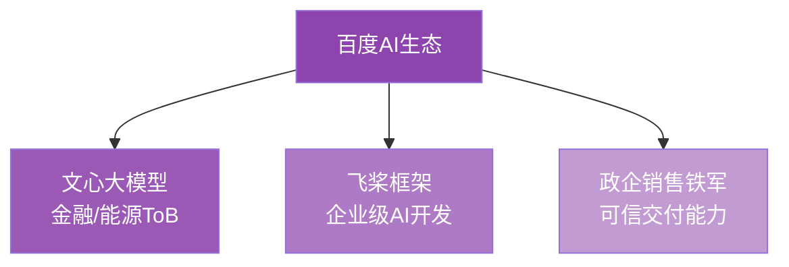
*   **核心底牌**:**知识图谱 + ToB 销售铁军**。
*   **现状**:虽然文心一言在网上总被调侃,但你看财报,百度在**金融、能源**领域的收入是实打实的。企业要的不是"最聪明"的模型,而是"最安全、最听话"的模型,这点百度最懂。
*   **我的判断**:百度靠的是"可信交付能力"，它不是流量公司，但它是最稳的政企供应商。

**4. 腾讯 (Tencent) —— "微信生态的AI化"**
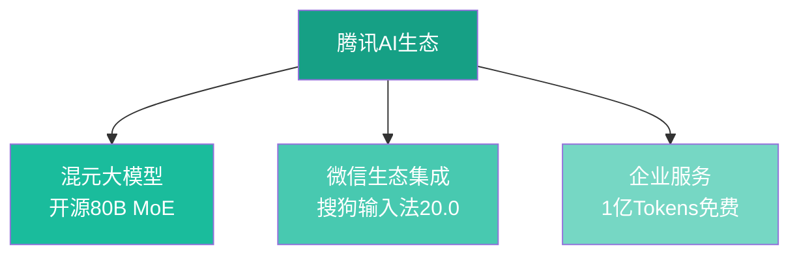
*   **核心底牌**:**混元大模型 + 微信生态**。
*   **现状**:2026年1月，搜狗输入法20.0版本深度集成混元大模型；微信小程序平台为开发者提供1亿Tokens免费额度。腾讯不靠AI赚钱，但用AI黏住用户。
*   **2025年大招**：开源Hunyuan Image 3.0（80B参数MoE架构），阿里云+微信生态的双重渗透策略。
*   **对标美国**：类似Google将Gemini集成进所有产品的策略——不单独卖模型，而是让AI成为生态的"润滑剂"。
*   **我的判断**：腾讯是"隐形玩家"，它不需要豆包那样的明星产品，只要微信用户离不开，AI就赢了。

### 🚀 攻城派:流量收割机

**5. 字节跳动 (ByteDance) —— "中国的 Meta AI + OpenAI"**
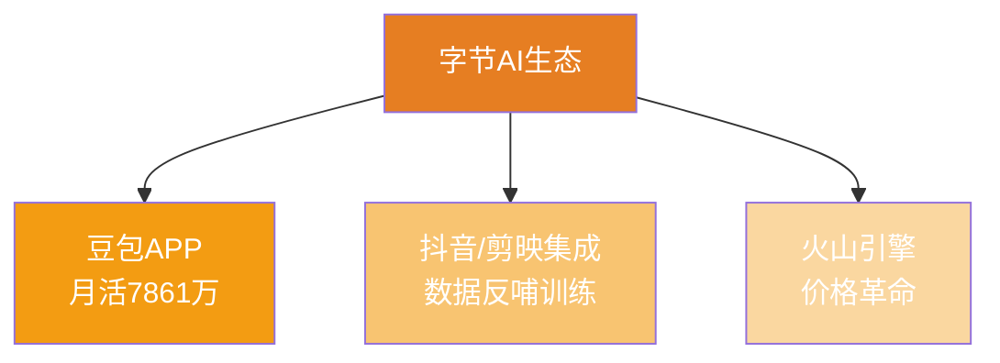
*   **核心底牌**:**豆包 (Doubao) + 推荐算法**。
*   **现状**:**月活7861万**（2026年1月数据），不仅是中国第一,而且是断层式的第一。字节根本不在乎模型参数是不是最大,它只在乎**推理成本 (Inference Cost)** 是不是最低。
*   **2025年大招**：通过火山引擎发起"价格革命"，将推理成本压到极致，快速抢占企业市场。
*   **对标美国**:对标 Meta AI (接近 600M MAU,寄生于 WhatsApp/Instagram) 的"社交寄生"策略 + OpenAI ChatGPT 的独立 App 模式。
*   **杀手锏**:它把 AI 塞进了抖音、剪映。你以为你在刷视频,其实你在帮它训练多模态模型。根据主报告,Meta 也是这样——通过 Instagram、WhatsApp、Messenger 收集数据,反哺 Llama 模型训练。
*   **我的判断**:字节的优势不是“模型”，而是“分发”。当分发和模型绑定，它就能把“效率工具”变成“增长引擎”。

**6. DeepSeek (幻方量化) —— "中国的 Anthropic"**
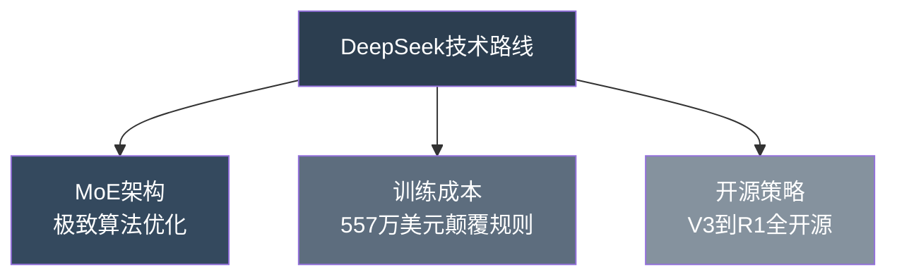
*   **标签**:**极客精神、MoE 架构**。
*   **现状**:它是中国 AI 界的一股清流。没有铺天盖地的广告,全靠技术硬核圈粉。DeepSeek 证明了:不需要烧几十亿美金,靠极致的算法优化(MoE)也能做出顶尖模型。
*   **对标美国**:对标 Anthropic 的技术极客路线——不追求规模,追求优雅和效率。Anthropic 的 Claude Opus 4.5 引入 "effort 参数" 可节省 65% tokens,DeepSeek 的 MoE 架构也是类似的极致优化思路。
*   **评价**:它是中国最像 OpenAI(早期)的公司,或者说更像 Anthropic——技术驱动,安静但强大。
*   **我的判断**:DeepSeek 的上限，不在“模型规模”，而在“工程效率”。如果它能持续把成本打下去，它就能持续赢。

**7. 月之暗面 (Kimi) —— "中国的 Gemini 长文本之王"**
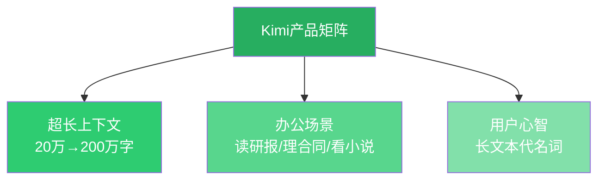
*   **标签**:**超长上下文 (Long Context)**。
*   **现状**:从 20 万字卷到 200 万字,Kimi 硬生生把"读研报"、"理合同"、"看小说"这个场景做成了自己的代名词。用户心智一旦形成,很难被迁移。
*   **对标美国**:对标 Google Gemini 3 的超长上下文能力(默认 5M tokens,Llama 4 Scout 更是 10M tokens)。在这个赛道上,Kimi 是中国的绝对王者,但需要警惕国际巨头的技术压制。
*   **我的判断**:Kimi 最强的不是“长上下文”，而是“用户心智”——这比参数更难复制。

---

## 🧊 第二章:独角兽的生死局

**2025年末-2026年初,发生了一件大事**：智谱AI和MiniMax先后登陆港交所,成为**全球首批上市的大模型公司**。

"AI六小龙"(智谱、MiniMax、月之暗面、阶跃星辰、百川智能、零一万物)的格局彻底分化：

**【AI六小龙格局图】**

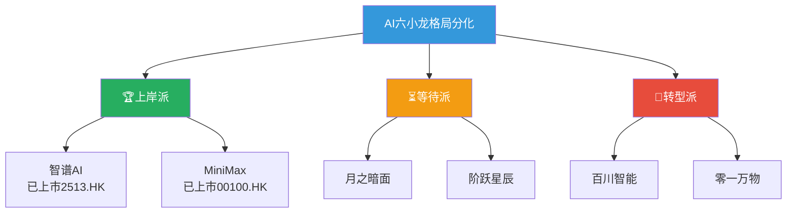

> **图表说明**（移动端请查看）：
> - **上岸派**：智谱AI（2026.1.8上市，股票代码2513，市值511亿港元）、MiniMax（2026.1.9上市，代码00100，估值461亿港元）
> - **等待派**：月之暗面Kimi（2026下半年筹备IPO）、阶跃星辰（坚守基础模型）
> - **转型派**：百川智能（转向垂直应用）、零一万物（出海生产力工具）

### 📊 上岸派的商业逻辑

*   **智谱 AI（2026年1月8日上市）**:
    - **路线**：MaaS（模型即服务）+ ToB
    - **数据**：服务12,000家企业客户、8000万终端设备、4500万开发者
    - **特点**：不仅模型强,Agent 规划能力也强。企业级任务（如自动写代码并部署）的首选

*   **MiniMax（2026年1月9日上市）**:
    - **路线**：C端多模态应用（Talkie陪聊、游戏NPC）
    - **特点**：最不像大模型公司的公司。本质上是**游戏/社交公司**,Talkie在海外陪聊市场赚得盆满钵满
    - **启示**：这才是真正的"AI Native"应用——不靠模型赚钱,靠应用赚钱

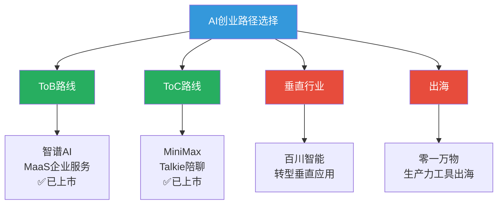

**我的判断**:
> 2026 年,**通用大模型的窗口期彻底关闭**。
> 以后没有什么"通用模型创业"了,只有"行业模型创业"或者"出海应用创业"。如果现在还没上牌桌,基本可以洗洗睡了。

**我的思考（更现实一点）：**
1. **融资寒冬不会再给“套壳”续命。**商业闭环是唯一活路。
2. **谁能拿到行业数据，谁就有壁垒。**模型能力在 2026 年已经足够“好用”。
3. **出海不是加分项，而是救命项。**国内红海太快，会逼出国际化。

---

## 🛠️ 第三章:应用层终于"爆"了

别光盯着模型,**L4 应用层**才是离钱最近的地方。

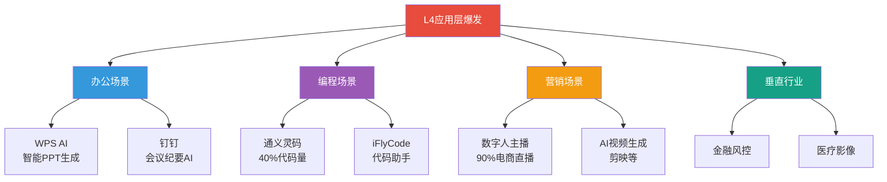

看看你身边:
1.  **办公**:**WPS AI** 帮你写 PPT,**钉钉** 帮你记会议纪要。这不是未来,这是标配。
2.  **代码**:**通义灵码**、**iFlyCode** 已经接管了初级程序员 40% 的代码量。
3.  **营销**:电商直播间里,那些不知疲倦回答你"宝宝几号链接"的主播,90% 都是数字人。

**一个新的公式出现了**:
$$ 价值 = (场景 \times 数据) \div 推理成本 $$

谁能把推理成本打下来,谁拥有独家数据,谁就是赢家。

**我的判断**:未来三年最赚钱的 AI 公司，不一定是模型公司，而是**能把“场景”做成“流程”的公司**。从“助手”变“执行者”，利润才会真正落地。
**我的思考**:当“流程”被固化，AI 就从“功能”升级为“基础设施”。这时竞争不再是产品力，而是组织执行力。

---

## 👁️ 第四章:中美对比——我们的差距与机会

最后,作为行业观察者,给你四个掏心窝子的判断:

**1. 关于"中美差距":认清现实,但不妄自菲薄**

根据主报告数据,让我们客观看待差距:

| 维度 | 中国现状 | 美国现状 | 差距 |
|:---|:---|:---|:---|
| **L1 算力芯片** | 华为昇腾 910C (受限于制程) | NVIDIA Blackwell/Rubin (3nm), 98%市占率 | 1-2代差距 |
| **L2 顶尖模型** | DeepSeek, Kimi (技术极客) | OpenAI ($500B), Anthropic ($180B+), xAI ($400B+) | 智力上 1-1.5年,资本上 10倍差距 |
| **L3 中间件** | 阿里百炼,华为盘古 | LangChain 1.0, Bedrock, Semantic Kernel (全球标准) | 生态广度不足,但国内够用 |
| **L4 应用** | 豆包 5000万DAU, Kimi 长文本之王 | ChatGPT 数亿用户, Cursor $29.3B, Meta AI 600M MAU | 消费级应用中国领先,但应用层独角兽估值差距巨大 |

**我的判断**:
- **L1 层 (算力)**: 华为在国内垄断,但对标 NVIDIA 全球生态,差距明显。xAI 的 100万GPU 集群 (Colossus)、Google 的 TPU v7 (42.5 exaflops)——这些是中国短期内追不上的规模。
- **L2 层 (模型)**: 在**顶尖模型智力**(比如 OpenAI o3 的逻辑推理, Claude Opus 4.5 的 Extended Thinking)上,我们承认还有 1-1.5 年的差距。但 DeepSeek 的 MoE 架构、Kimi 的长文本,证明了在细分赛道上可以突破。
- **L4 层 (应用)**: 这是我们的**相对优势**。豆包的 DAU、抖音的 AI 集成速度,甚至超过了美国同类产品。但需要警惕——**Cursor 在 5个月内估值从 $9.9B 飙升至 $29.3B**,证明应用层也能诞生超级独角兽,这是中国创业者的机会窗口。

**2. 关于"泡沫破裂"**
2026 年是**套壳公司的葬礼**。
那些只是套个 API 做个"聊天壳"的公司,今年会死得很惨。活下来的,要么是手握算力的(华为),要么是手握场景的(字节),要么是技术极度硬核的(DeepSeek)。

根据主报告,美国的 Cursor ($29.3B 估值) 证明了:**应用层要建立真正护城河——索引系统、私有模型、复杂交互逻辑**,而不是简单的 API 包装。

**3. 关于"Agentic AI":这是中国弯道超车的机会**

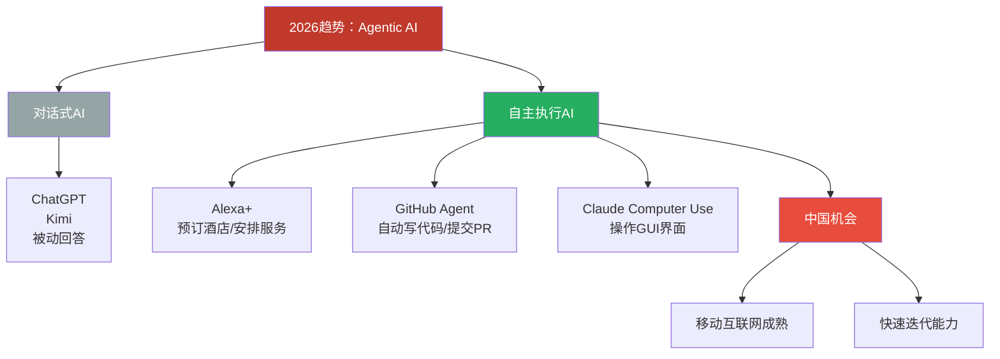

主报告揭示的 2026 最大趋势:**从对话到自主执行**。中国在这个赛道上有机会:**移动互联网生态成熟 + 快速迭代能力**。如果豆包、Kimi 能快速演进成"任务执行者",而不只是"聊天助手",就有机会在全球竞争中占据一席之地。

**4. 给普通人的建议**
别去焦虑 AI 会不会取代你。
去用该用的工具:用 Kimi 读长文,用豆包练口语,用通义写代码。

**在这个时代,会用 AI 的人,就是比不会用 AI 的人强。这很残酷,但很公平。**

而且根据主报告,**语音优先时代已经来临** (xAI Grok Voice <1秒延迟, Gemini Live ~100ms延迟)。学会通过语音与 AI 交互,将是下一个必备技能。

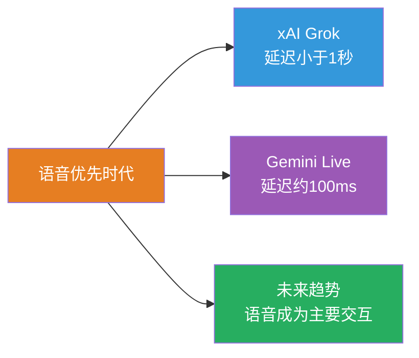

**给读者的 3 步行动清单**

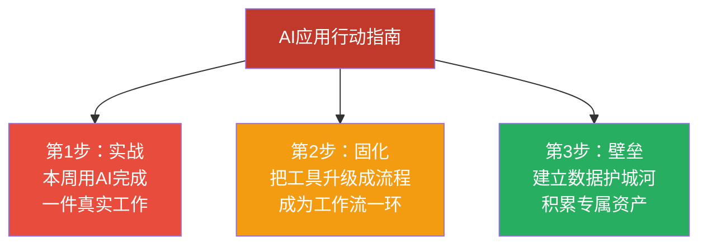

---

## 附录:想了解更多?

本文是《2026 AI 产业链与价值链:六大巨头与独角兽全景分析》的中国版精简版。

如果你想深入了解:
- 美国六大科技巨头 (Apple, Nvidia, Microsoft, Google, Amazon, Meta) 的 AI 全栈布局
- OpenAI ($500B), Anthropic ($180B+), xAI ($400B+) 的最新进展
- Cursor 如何在 5个月内估值从 $9.9B 飙升至 $29.3B
- L1-L4 各层的详细技术解析

**请在公众号后台回复 "AI2026" 获取完整版报告**

---

*觉得分析有道理?点个**「在看」**,转发给需要看到这篇文章的朋友。*
*关注 **MyAgentToolBox**,我们在 AI 的最前线等你。*

*(本文成文于 2026 年 2 月,基于真实产业调研与对标美国六大科技巨头的深度分析)*

**数据来源**:
- 公开财报与科技媒体报道
- 各公司官方发布 (OpenAI, Anthropic, xAI, Google, Microsoft, Meta, Amazon, NVIDIA)
- 主报告:《2026 AI 产业链与价值链:六大巨头与独角兽全景分析》
