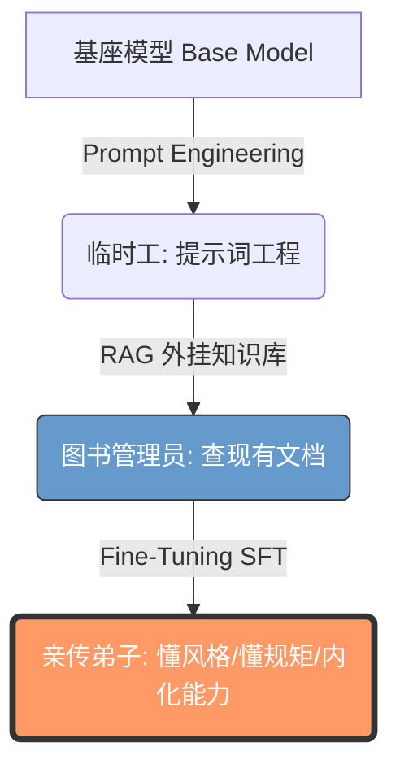
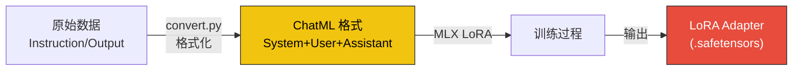
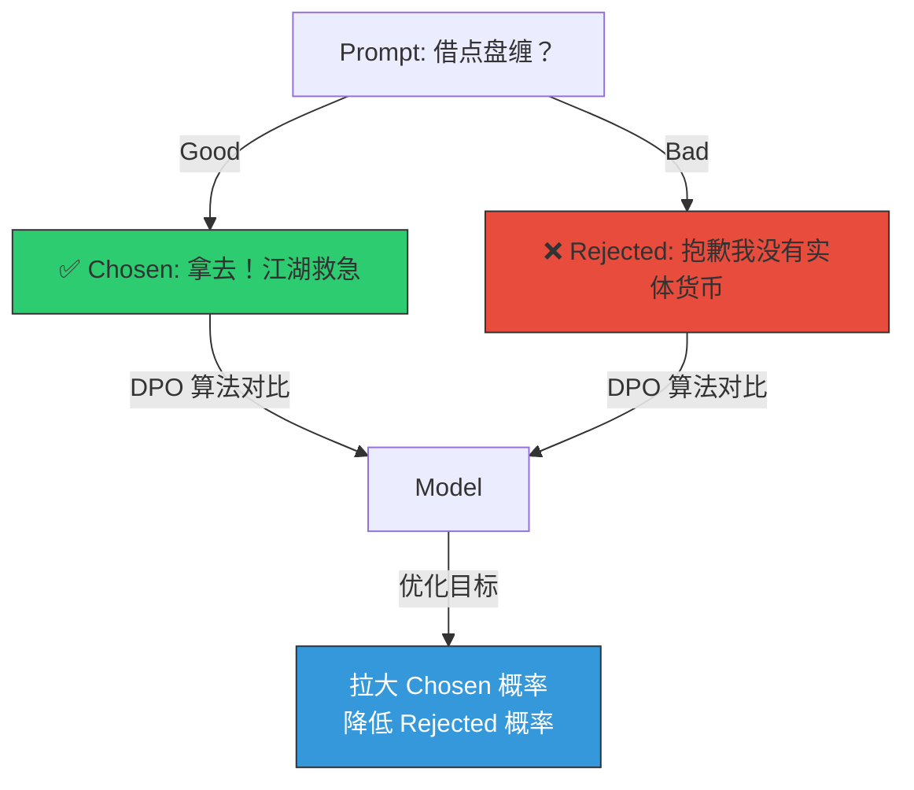
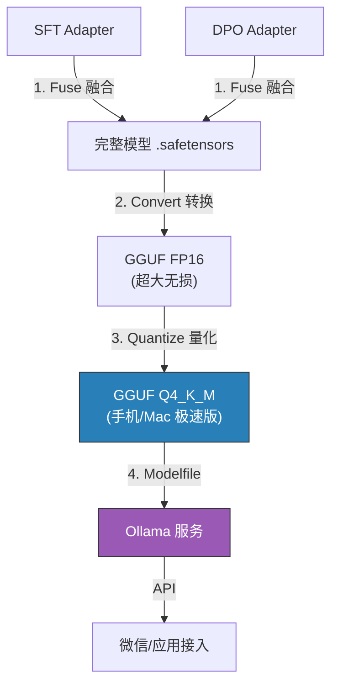

---
title:
  zh: "手把手：把大模型微调成你的私人助理（M3 Max 实战版）"
  en: "Step-by-Step: Fine-Tune a Large Model into Your Personal Assistant (M3 Max Practical Edition)"
description:
  zh: "基于真实项目的实操记录，在 MacBook Pro M3 Max (64GB RAM) 上完成 LLM 微调，打造专属私人助理。拒绝云评测，全是干货。"
  en: "Practical records based on real projects, completing LLM fine-tuning on MacBook Pro M3 Max (64GB RAM) to create a personalized assistant. No cloud reviews, all practical content."
date: "2026-03-25"
category: "Practical Guide"
tags: ["LLM Fine-tuning", "Personal Assistant", "M3 Max", "Local AI"]
draft: false
author: "James Xie"
---

# 手把手：把大模型微调成你的私人助理（M3 Max 实战版）

**作者**：谢先生  
**定位**：基于真实项目的实操记录（拒绝云评测）  
**实战环境**：MacBook Pro M3 Max (64GB RAM)  
**核心框架**：Apple MLX (放弃 PyTorch/CUDA 执念)

---

## 0. 背景：为什么你需要一个“训练过”的模型？

在开始烧显卡之前，甚至很多人分不清 **Prompt Engineering（提示词）**、**RAG（知识库）** 和 **Fine-tuning（微调）** 的区别。

### 💡 灵魂三问
1.  **为什么不直接写 Prompt？**  
    Prompt 是“临时工”，字数有限，稍微复杂点的指令（比如模仿你的某种特殊文风、记住几百个产品规则）它就忘，而且每次对话都要重复输入，费钱费时。
2.  **为什么不挂个知识库 (RAG)？**  
    RAG 是外挂硬盘，适合查资料（如“公司报销流程是什么”）。但如果你想让模型**学你的思考方式**（如“看到这种Bug报错，下意识先查网络连接”），光靠查文档是没用的，这种“直觉”和“风格”必须刻在脑子里（权重里）。
3.  **微调到底是在调什么？**  
    我们今天做的叫 **SFT（监督微调）**，本质上是把你的“做事习惯”内化给模型。
    *   **通用模型**：像一个刚毕业的学霸，什么都懂一点，但不懂你的规矩。
    *   **微调模型**：像跟了你三年的徒弟，你眼神一动，它就知道这封邮件该怎么回，用词该多犀利。

**一句话总结**：如果你需要查**新知识**，用 RAG；如果你需要固化**能力和风格**，必须微调。



---

## 1. 写在前面的“实战心得”

很多教程只会教你跑通 `Hello World`，但真正在 M3 Max 上落地时，你会发现：
1.  **别在 Mac 上死磕 Docker/CUDA**：效率极低。Apple 官方的 **MLX** 才是正解，统一内存（Unified Memory）架构能让 GPU 直接读内存，64GB 显存等于 NVIDIA A6000 级别（虽然慢点，但能跑大模型）。
2.  **数据质量 > 模型参数**：我实测 100 条高质量的“谢先生风格”数据，比 10000 条开源通用数据效果好得多。
3.  **部署才是大坑**：训练完的模型只是个 `.safetensors` 文件，要把它变成手机/电脑上随时能用的 Chatbot，你需要 GGUF + Ollama。

本教程基于我真实的 **Session 1 (SFT)** 和 **Session 3 (DPO + 落地)** 踩坑记录。

---

## 2. 为什么选择 MLX 而不是 QLoRA？

在 Session 1 的尝试中，我发现由 `bitsandbytes` 驱动的传统 QLoRA 在 macOS Metal 上兼容性很差，经常报算子不支持。

**MLX 的优势（实测）**：
- **原生适配**：专为 Apple Silicon 设计，满血发挥 GPU/NPU。
- **环境极简**：没有复杂的 CUDA 依赖，`pip install` 就能用。
- **显存黑魔法**：DPO 训练时，MLX 对统一内存的利用率极高，64GB 内存能勉强跑起 7B 模型的 DPO（这在传统显卡上需要 48GB+ 独显）。

---

## 3. Hands-on：SFT 微调（教它“怎么说话”）

### ✅ Step 1: 环境极速搭建 (UV 是神器)

别用 Conda 了，`uv` 是 Python 包管理的未来，速度快 10-100 倍。

```bash
# 1. 极速安装环境
mkdir -p ~/llm_training/my_assistant
cd ~/llm_training/my_assistant
uv venv --python 3.11
source .venv/bin/activate

# 2. 安装 Apple MLX 全家桶
uv pip install mlx mlx-lm transformers datasets
```

### ✅ Step 2: 数据的“致命格式”坑

**这是我踩的第一个大坑**。
通用的 SFT 数据通常是 `{"instruction": "...", "output": "..."}`。
但在 MLX 的 `lora` 工具里，它并不自动帮你拼接 Prompt！你必须把 System Prompt + User + Assistant 拼成一个完整的字符串给它。



**实战脚本 (save as `convert.py`)**：
```python
import json

# Qwen2.5 的标准 ChatML 格式（错一点模型就变傻）
def format_prompt(instruction, output):
    return f"""<|im_start|>system
你是一位资深技术博主谢先生，通过干货满满的文章帮助大家理解 AI。<|im_end|>
<|im_start|>user
{instruction}<|im_end|>
<|im_start|>assistant
{output}<|im_end|>"""

# 读取你的原始数据
with open("my_input.jsonl", "r") as f_in, open("train.jsonl", "w") as f_out:
    for line in f_in:
        item = json.loads(line)
        # 必须转成 {"text": "..."} 格式
        new_item = {"text": format_prompt(item['instruction'], item['output'])}
        f_out.write(json.dumps(new_item, ensure_ascii=False) + "\n")
```

### ✅ Step 3: 一行命令开始训练

在 M3 Max 上，这套参数是我调试多次后的**最佳甜点**：

```bash
mlx_lm.lora \
    --model Qwen/Qwen2.5-7B-Instruct \
    --train \
    --data ./ \
    --batch-size 4 \
    --lora-layers 16 \
    --iters 600 \
    --learning-rate 1e-5 \
    --save-every 100 \
    --adapter-path ./adapters
```

**💡 谢先生实测数据**：
- **Batch Size=4**：64GB 内存占用约 32GB，如果开到 8 可能会卡顿。
- **Iters=600**：对于 100-300 条数据，600 步通常能收敛到 Loss < 0.8，再多就过拟合了。
- **速度**：M3 Max 能跑到 300+ tokens/sec 的训练速度，非常惊人。

---

## 4. Hands-on：DPO 对齐（教它“分辨好坏”）

SFT 只是让模型学会了格式，但它可能还是会胡说八道。Session 3 的 DPO (Direct Preference Optimization) 是让模型变聪明的关键。

**⚠️ 高能预警**：DPO 需要同时加载两个模型（策略模型 + 参考模型），显存消耗翻倍！



### ✅ 核心坑：DPO 数据构建
你需要准备三元组：`{Prompt, Chosen(好), Rejected(坏)}`。

**我的实战策略**：
- **Chosen**：是你精心修改过的完美回答。
- **Rejected**：直接用 GPT-3.5 生成的那些“正确的废话”。让模型学会“拒绝啰嗦”。

### ✅ MLX DPO 训练命令

如果你发现 OOM (内存不足)，请把 `batch-size` 降为 1。

```bash
# 注意学习率要极低！1e-6 是安全线
mlx_lm.dpo \
    --model Qwen/Qwen2.5-7B-Instruct \
    --train \
    --data ./dpo_data \
    --learning-rate 1e-6 \
    --batch-size 1 \
    --lora-layers 8 \
    --iters 200 \
    --adapter-path ./adapters_dpo
```

---

## 5. 落地：从 Python 脚本到 Ollama 服务

训练完不是结束，这步最关键。我们要把模型转换成 **GGUF** 格式，塞进 Ollama 里。



### ✅ Step 1: 融合 (Fuse)
LoRA 只是外挂，必须把它“焊死”在模型里。

```bash
mlx_lm.fuse \
    --model Qwen/Qwen2.5-7B-Instruct \
    --adapter-path ./adapters \
    --save-path ./models/xie-assistant-fused \
    --dequantize
```

### ✅ Step 2: 转换与量化 (llama.cpp)
这是很多小白卡住的地方。你需要编译 `llama.cpp`。

```bash
# 1. 转为 FP16 GGUF
python convert_hf_to_gguf.py ./models/xie-assistant-fused --outfile temp.gguf --outtype f16

# 2. 量化为 Q4_K_M (体积/性能最佳平衡点)
./llama-quantize temp.gguf xie-assistant-q4.gguf Q4_K_M
```

### ✅ Step 3: Ollama 里的 Modelfile 陷阱

你以为有了 GGUF 就能跑？错！**Template 设错，模型必傻。**
Qwen 2.5 必须严格遵守 ChatML 模板。

创建 `Modelfile`：
```dockerfile
FROM ./xie-assistant-q4.gguf

# ⚠️ 这里的 TEMPLATE 一个字符都不能错
TEMPLATE """{{ if .System }}<|im_start|>system
{{ .System }}<|im_end|>
{{ end }}{{ if .Prompt }}<|im_start|>user
{{ .Prompt }}<|im_end|>
{{ end }}<|im_start|>assistant
"""

SYSTEM "你是一位资深技术博主谢先生..."
PARAMETER stop "<|im_end|>"
PARAMETER stop "<|im_start|>"
```

最后执行：`ollama create xie-gpt -f Modelfile`

---

## 6. 总结：普通人的下一张船票

这几天的折腾让我明白了一个道理：
**大模型的训练门槛已经降到了地板上，但“Know-How”的门槛依然在天花板。**

我们正站在一个分水岭上：昨天我们还是 AI 的“使用者”（Prompt Engineer），今天我们必须成为 AI 的“驯兽师”（Model Trainer）。

### 1. 为什么“私有微调”是普通人的最后堡垒？
OpenAI 和 DeepSeek 会把通用模型做到 100 分，但哪怕它们再强，也永远不知道**你**公司里的潜规则，不知道**你**写代码的怪癖，更不知道**你**对客户说话的微妙分寸。
- **通用模型**解决 80% 的问题（百科全书）。
- **微调模型**解决剩下 20% 最值钱的问题（行业秘辛）。

### 2. 你的核心资产不是显卡，是数据
别羡慕别人有 H100 集群。
如果你是一位资深律师，你硬盘里存改过的 500 份合同；如果你是一位金牌销售，你聊天记录里的 1000 次话术攻防——**这才是真正的护城河**。
按照本文的流程，哪怕不需要联网，你的数据也能在本地变成一个“懂行”的智能体。

### 3. 从“下指令”进阶到“定标准”
做 Prompt 是在**下指令**，做 DPO（构造 Good vs Bad 数据）是在**定标准**。
未来最有价值的技能，是**审美**和**判断力**。你能清楚地告诉模型：*“这句话虽然逻辑对，但不够‘谢先生’，我要的是这种味道……”* 这种微调能力，将是未来超级个体的标配。

**一句话送给大家**：
> 不要总想着造一艘航母（训练基座大模型），不如先在自己的后院里，造一艘懂你心意的快艇（垂直微调模型）。

---

## 附录：写给新手的“黑话”词典

如果你第一次接触大模型训练，这几个词可能会让你晕头转向，这里有个通俗版解释：

*   **Base Model (基座模型)**：
    相当于大学刚毕业的通才，博闻强记但不懂具体业务规矩。
*   **SFT (Supervised Fine-Tuning - 监督微调)**：
    “岗前培训”。给模型看几百个真实问答案例，教它学会某种特定的说话风格或业务流程。
*   **LoRA (Low-Rank Adaptation)**：
    “戴眼镜”。我们不动模型原本的大脑（几百亿个参数），只给它加一层薄薄的滤镜。这样训练极快，且不破坏模型原有的通用能力。
*   **DPO (Direct Preference Optimization)**：
    “绩效考核”。不只教它说什么（SFT），更通过好坏对比（Good vs Bad），教会它**不该**说什么（比如拒绝啰嗦、拒绝幻觉）。
*   **GGUF / 量化 (Quantization)**：
    “模型瘦身”。原本的模型像无损音乐（FP16，体积大），量化就是转成 MP3（Int4，体积小），让手机和笔记本也能流畅运行。
*   **Ollama**：
    “播放器”。如果你把 GGUF 模型比作 MP3 文件，Ollama 就是那个万能播放器，它负责把模型跑起来并提供接口。

---

**下期预告**：
如何把这个训练好的 Ollama模型，接入微信公众号后台，让它 24 小时自动回复读者？
关注 **MyAgentToolBox**，我们下周见。
